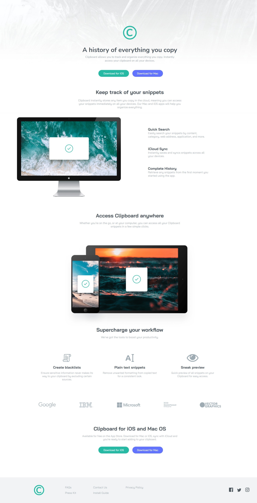

# Frontend Mentor - Clipboard landing page solution

This is a solution to the [Clipboard landing page challenge on Frontend Mentor](https://www.frontendmentor.io/challenges/clipboard-landing-page-5cc9bccd6c4c91111378ecb9). Frontend Mentor challenges help you improve your coding skills by building realistic projects. 

## Table of contents

- [Overview](#overview)
  - [The challenge](#the-challenge)
  - [Screenshot](#screenshot)
  - [Links](#links)
- [My process](#my-process)
  - [Built with](#built-with)
  - [What I learned](#what-i-learned)
  - [Continued development](#continued-development)
- [Author](#author)

## Overview

### The challenge

Users should be able to:

- View the optimal layout for the site depending on their device's screen size
- See hover states for all interactive elements on the page

### Screenshot

This is the screenshot of the page.

### Links

- Solution URL: [Click here!](https://www.frontendmentor.io/solutions/clipboard-landing-page-W-8mXqzekL)
- Live Site URL: [Click here!](https://clipboard-landing-page-six-ivory.vercel.app/)

## My process

### Built with

- Semantic HTML5 markup
- CSS custom properties
- Flexbox
- CSS Grid

### What I learned

I learnt some new things while making this webpage - making a custom logo using CSS, writing text over an image, putting an image and the text side-by-side.

(Although I used the help of internet and ChatGPT, I am learning new things with new projects and I am not blindly copying things, I understand the usecase of each and everything that I use in making of the project.)

### Continued development

The buttons on the page has to be given a soft and small 3D look. And the webpage is not responsive, that will be done.

## Author

- Website - [Clipboard Page](https://clipboard-landing-page-six-ivory.vercel.app/)
- Frontend Mentor - [@waghmare-amit](https://www.frontendmentor.io/profile/waghmare-amit)
- Twitter - [@waghmareamit24](https://www.twitter.com/waghmareamit24)

